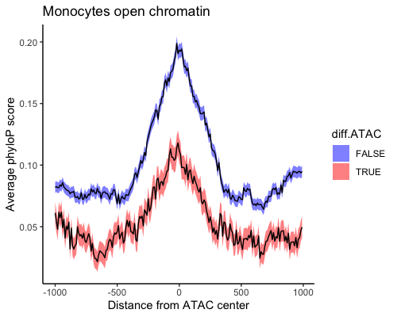
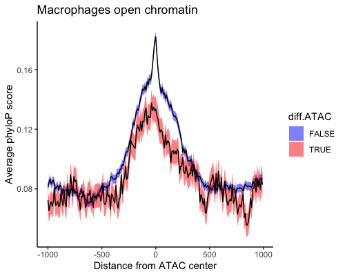

# Conservation of Regulatory DNA Sequence x Context

## Overview
Cis-regulatory DNA elements have significantly higher conservation than randomly selected DNA sequences, and distal cis-regulatory regions such as enhancers are less conserved and evolve rapidly relative to promoters. This demo shows the stimulation-specific open chromatin regions determined by ATAC-seq for human immune cells are more likely to be distal enhancers and have faster functional evolution (lower averaged phyloP scores) than non-differential ATACs.

## Source of data
- ATAC-seq data from human primary [monocytes](https://zenodo.org/record/8158923) treated with lipopolysaccharide or interferon-γ.
- ATAC-seq data from monocyte derived [macrophages](https://www.ncbi.nlm.nih.gov/geo/query/acc.cgi?acc=GSE172116) treated with lipopolysaccharide for acute response and tolerance.
- phyloP score, the -log(p value) under a null hypothesis of neutral evolution, derived from the alignment of 100 vertebrate genomes per base from the [UCSC Genome Browser](http://hgdownload.cse.ucsc.edu/goldenpath/hg38/phyloP100way/). 


## Usage
#### Requirements
* Linux
* R>=3.6

#### Example

To calculate the conservation scores for each ATAC peak, the midpoint of each recurrent ATAC peak was first flanked by a ±1Kb window, which was then devided into 10bp bins. The averaged phyloP conservation scores for each region were calculated in 10-bp bins using [bigWigAverageOverBed](http://hgdownload.soe.ucsc.edu/admin/exe/)(version2).

```
bash ./scripts/phyloP.sh
Rscript ./scripts/plot.R ./output/monocyte_phyloP.tab ./data/diff.ATACs_mono.bed
Rscript ./scripts/plot.R ./output/MDMs_phyloP.tab ./data/diff.ATACs_MDMs.bed
```

## Output & visualisation



Average PhyloP conservation scores of the ±1Kb genomic regions centered on differential ATAC peaks (red) and non-differential peaks (blue).

## Contact
email to pzhang@well.ox.ac.uk with any questions about this repository.
